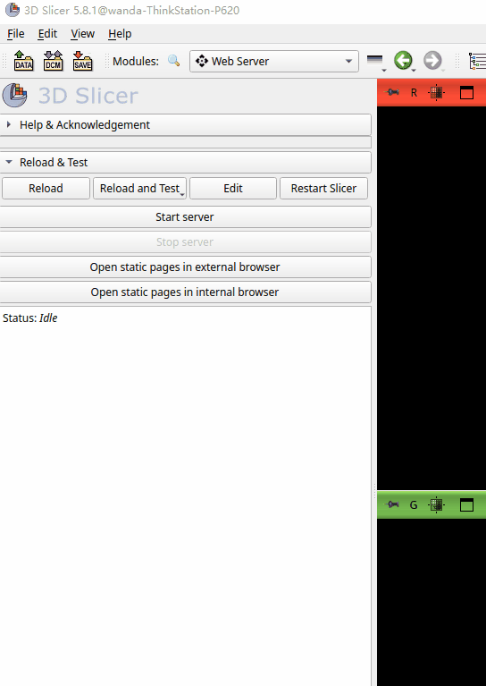

# SlicerAgent

SlicerAgent is a manus-like agent in 3D Slicer.

## Features
1. *Native agent function call* : provide basic capabilities for SlicerAgent.
2. *Web Server MCP server* : encapsulate Web Server Extension in Slicer as a MCP server, helping SlicerAgent to inspect Slicer status.
3. *Native Slicer function call* : a function decorator used to turn functions of extension into tools that SlicerAgent can execute.

## Demo



## QuickStart (Maybe)

> The current version of SlicerAgent is not stable enough for you to run on your machine easily.

> As SlicerAgent use python 3.12 but Slicer haven't support 3.12  [yet](https://github.com/Slicer/Slicer/issues/7060), there is a lot of work to be done, that means the instruction below may be out-of-date ater some upgrade.

1. clone this repo
2. install python environment
```bash
cd sliceragent
uv sync
```
3. replace python path in app/slicer/process.py with your uv python executable
4. run SlicerAgent out of Slicer
```bash
uv run python main.py
# input below lines in the terminal
{"content": "who are you?", "type": "message"}
{"content": "exit", "type": "command"}
{"content": "How many nodes are there in Slicer", "type": "message"}
{"content": "How to use python code to print these nodes in Slicer?", "type": "message"}
```
5. run SlicerAgent in Slicer: 
- Firstly add directory `SlicerExtensionDemo` as an extension in your 
Slicer.
- Start Slicer and start server in  `Web Server` extention.
- Switch to `AgentUI` extention and input your quesion in textEditor.